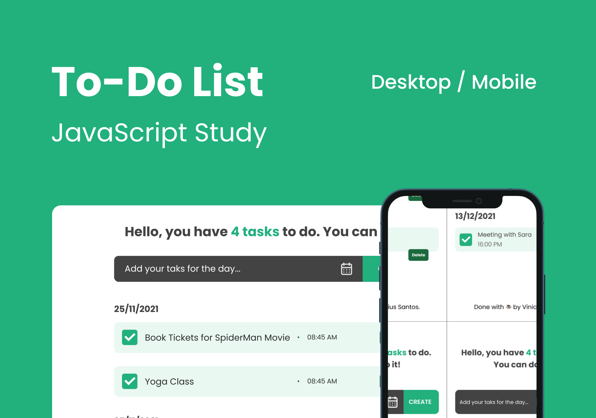

# Task List App

 

Task List is a Front-End Project that allows you to create a to-do list and organize them by date.

> **[Live demo](https://santos-vinicius.github.io/task-list/)**

### Project Details

---

This front-end project was developed to test and learn some skills after completing the Front End qualification by @Alura.

### Stacks

---

This project was developed using the following technologies:

- JavaScript
- HTML
- CSS

### Layout

---

This project UI was developed by **Vinicius Santos** on **Figma**, you can view the layout details through the links below:

- [Figma Layout](https://www.figma.com/file/yJHmhe4hQKUs976VMi2A6E/task-list-app?node-id=0%3A1).

> Remembering that you need to have a [Figma](https://www.figma.com/) account to access it.

### Demo

---

- [Task List live demo](https://santos-vinicius.github.io/task-list/)

### Contributing

---

Contributions, issues and feature requests are welcome!
Feel free to check [issues page](https://github.com/santos-vinicius/task-list/issues).

**Vinicius Santos**

- Github: [@santos-vinicius](http://github.com/santos-vinicius)

### Show your support

---

Give a ⭐ if you like this project.

### License

---

This project is MIT licensed. See the LICENSE file for details.

---

 README was made with ☕ and 💛 by Vinicius Santos. 

