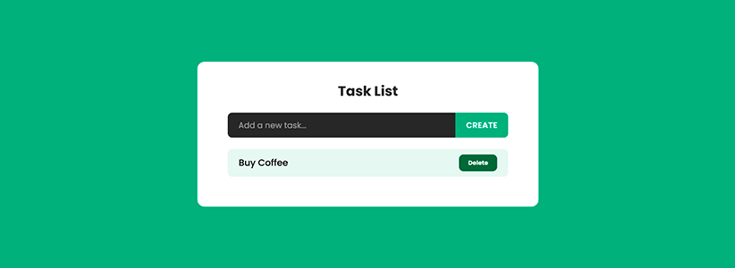

# Task List Project

Task List is a Front-End Project that allows you to create a to-do list.

> **[Live demo](https://santos-vinicius.github.io/task-list/)**

### Project Details

---

This front-end project was developed to test and learn some skills after completing the Front End qualification by @Alura.

### Stacks and Resources

---

This project was developed using the following technologies:

- JavaScript
- HTML
- CSS
- Mobile First

### Demo

---

- [Task List live demo](https://santos-vinicius.github.io/task-list/)

### Contributing

---

Contributions, issues and feature requests are welcome!
Feel free to check [issues page](https://github.com/santos-vinicius/task-list/issues).

### Author

---

**Vinicius Santos**

- Twitter: [@santosviniciusv](http://twitter.com/santosviniciusv)

### Show your support

---

> Give a ⭐ if you like this project.

### License

---

This project is MIT licensed. See the [LICENSE](https://github.com/santos-vinicius/task-list/blob/main/LICENSE) file for details.

---

 Made with ☕ and 💛 by Vinicius Santos. 

